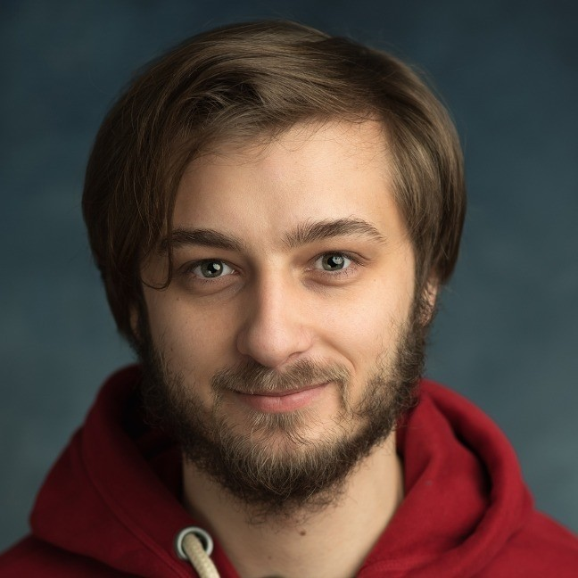

Hi, I'm Maciej Czarnecki, a passionate C++ developer with a strong backend focus and an interest in full-stack development. Over the years, I've worked on cybersecurity software, map renderer, and Qt-based applications, excelling in problem-solving and tools development.

💡 Most of my work was in closed-sourced project, but I hope that I will have more opportunities to contribute to open source.

📚 When I’m not coding, I dive into side projects or share my expertise. Check out my repositories to see what I’m working on!

🌐 Connect with me on [LinkedIn](https://www.linkedin.com/in/maciejczarnecki/)

